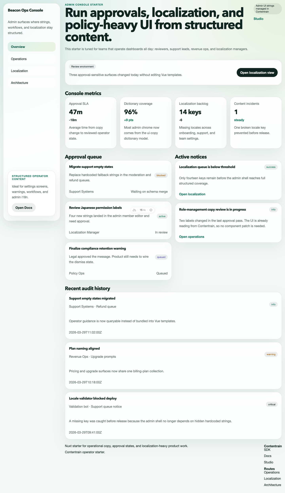
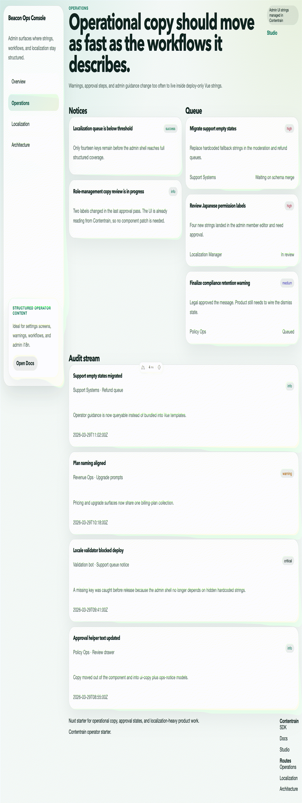

> Source of truth: this starter is exported from the `contentrain-starters` monorepo.
> Internal starter id: `nuxt-admin-console`.
# Contentrain Nuxt Admin Console

Nuxt starter for internal tools, admin dashboards, and operational surfaces where UI strings, approval copy, and audit-heavy content need stronger structure.





## Start

```bash
pnpm install
pnpm dev
```

## Commands

```bash
pnpm check
pnpm build
pnpm preview
pnpm deploy:netlify
```

## Demo routes

- `/`
- `/localization`
- `/operations`
- `/architecture`

## Why this starter exists

- Operator-facing screens often accumulate the worst hardcoded copy debt
- Contentrain models approval states, settings matrices, queue items, and notices as structured content
- The starter keeps the UI framework-native while moving volatile text into typed local content

Official references:

- [SDK](https://ai.contentrain.io/packages/sdk.html)
- [Docs](https://docs.contentrain.io/)
- [Studio](https://studio.contentrain.io/)

## Deploy

- Netlify build command: `pnpm deploy:netlify`
- Netlify publish directory: framework-managed
- The starter already sets `NITRO_PRESET=netlify` inside the deploy script

## Netlify Project Creation

[](https://app.netlify.com/start/deploy?repository=https%3A%2F%2Fgithub.com%2FContentrain%2Fcontentrain-starter-nuxt-admin-console)

Use `pnpm dlx netlify-cli init` to connect the repository for continuous deployment, or `pnpm dlx netlify-cli link` if the site already exists.
